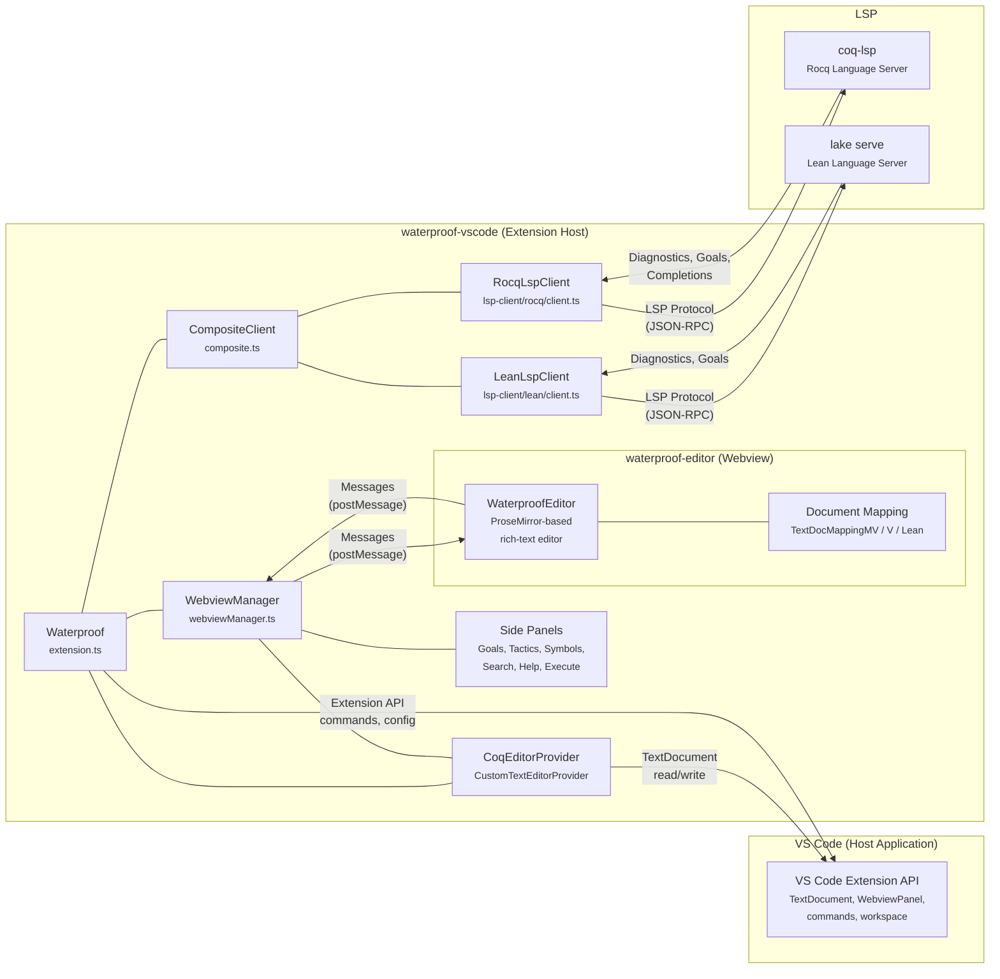
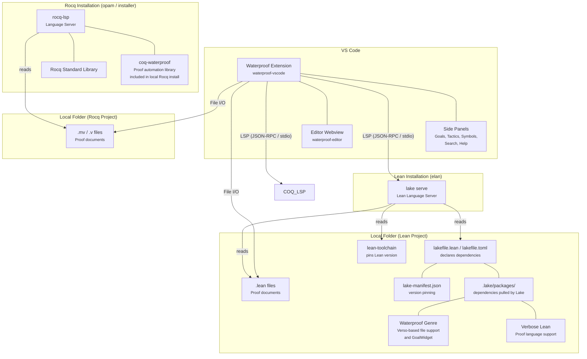

# Waterproof Architecture

## Overview

Waterproof is a VS Code extension that helps students learn to write mathematical proofs. It provides a rich ProseMirror-based editor for exercise sheets and communicates with a Language Server Protocol (LSP) backend for proof checking, diagnostics, and completions.

The system is composed of four main components:

1. **`waterproof-editor`** — A ProseMirror-based rich-text editor (npm package `@impermeable/waterproof-editor`) that runs inside a VS Code webview. It handles document editing, rendering, and user interaction (cursor changes, input areas, symbols, tactics). Supports multiple file formats: `.mv` (MarkdownV), `.v` (RegularV), and `.lean` (Lean), each with its own document serializer.

2. **`waterproof-vscode`** — The VS Code extension host logic. It orchestrates everything: manages webviews via the `WebviewManager`, routes messages between the editor and the LSP clients, handles file I/O through VS Code's `CustomTextEditorProvider`, and provides side panels (goals, search, help, tactics, symbols, execute, debug). A `CompositeClient` manages both Rocq and Lean LSP clients simultaneously, routing requests to the correct client based on `document.languageId`.

3. **VS Code** — The host application providing the extension API, webview infrastructure, text document model, command palette, and UI chrome (status bar, side panels, themes).

4. **LSP (Language Servers)** — Two external language server processes run concurrently (note that students will generally use just one in practice):
   - **rocq-lsp** for Rocq (`.mv` and `.v` files) — provides proof checking, diagnostics, goal information, completions, and command execution.
   - **Lean Language Server** via `lake serve` for Lean (`.lean` files) — provides proof checking, diagnostics, and goal information.

## Component Diagram

The diagram below shows how these four components relate to each other.

### Interaction Flow

1. **Document open**: VS Code opens an `.mv`, `.v`, or `.lean` file and activates the `CoqEditorProvider`, which creates a `ProseMirrorWebview`. The webview loads the `waterproof-editor` bundle with the appropriate document serializer and mapping for the file format, and initializes a ProseMirror editor instance with the document content.

2. **Editing**: When the user edits the document in the ProseMirror editor, changes are sent as `docChange` messages to the extension host via `postMessage`. The `ProseMirrorWebview` applies these changes to the VS Code `TextDocument` through a `SequentialEditor`. VS Code's document model then notifies the appropriate LSP client of the change.

3. **Language routing**: The `CompositeClient` inspects `document.languageId` to route requests to the correct LSP client. Documents with `languageId === 'lean4'` (`.lean` files) are handled by `LeanLspClient`; all others (`.mv`, `.v`) are handled by `RocqLspClient`.

4. **Proof checking**: The LSP server reads the exercise sheets on disk, and communicates the diagnostics through the LSP client. These diagnostics are routed through the `WebviewManager` to the editor as `diagnostics` messages.

5. **Goal display**: When the cursor moves, the editor sends a `cursorChange` message. The `CompositeClient` delegates to the active client, which queries its language server for goals at that position. For Rocq, goals are returned as structured `PpString` objects; for Lean, goals are returned as plain strings via the `$/lean/plainGoal` request. Results are rendered in the Goals side panel.

6. **Input area status**: Both clients determine proof status within input areas. In `.mv` files, input areas are delimited by `<input-area>` tags. In Lean files, input areas use `:::input` / `:::` delimiters. The `LeanLspClient` checks proof status by requesting goals at the end of each input area; an empty goals list indicates a correct proof.

7. **Commands**: Help commands originate from side panels, flow through the `WebviewManager`, and are executed via the LSP client. Note: the Lean client does not currently support viewport hints or arbitrary command execution.

## Deployment Diagram

The deployment diagram shows the runtime environment for Waterproof, including the proof assistants it supports (Rocq and Lean) and their dependency management.

### Rocq Deployment

For Rocq-based projects, the language server is **rocq-lsp**. The extension communicates with it over JSON-RPC. The required libraries are part of the local Rocq/opam installation:

- **coq-lsp** is installed via opam
- **coq-waterproof** is a Rocq plugin that provides proof automation tactics tailored for Waterproof. It is installed into the same opam switch, making it available to coq-lsp at runtime.
- On Windows, a bundled installer can set up all Rocq dependencies in a self-contained folder.

### Lean Deployment

To run Lean projects, Lean must be installed through `elan`. This provides access
to the `lake` command, which is used to manage dependencies.

For Lean-based projects, the language server is started via **`lake serve`**. The extension runs `lake serve` as the LSP server process, configured through the `waterproof.lakePath` setting (defaults to `lake` on PATH) and optional `waterproof.lakeArgs` arguments.

Before starting the Lean client, a prelaunch check verifies that `lake --version` executes successfully. If this fails (e.g. Lake is not installed), the Lean client is skipped and only the Rocq client starts.

The Lean project folder must contain:

- **`lakefile.lean`** or **`lakefile.toml`** — declares project dependencies. Lake pulls required packages from remote Git repositories into the `.lake/packages/` directory. A dependency on the Waterproof Genre is necessary. This provides LSP support
on markdown-esque files through Verso, as well as a GoalWidget for better goal display. A dependency on Verbose Lean, which provides proof language support,
is required (unless the exercise sheet is plain Lean).
- **`lean-toolchain`** — pins the Lean version for the project.
- **`lake-manifest.json`** — locks dependency versions for reproducible builds.

Dependencies are cached locally after the first fetch. The Lean language server resolves imports using the Lake build configuration and provides proof checking, diagnostics, and goal information.

**Key differences from the Rocq client:**
- Goals are requested via `$/lean/plainGoal` (returns plain strings) instead of the Rocq `proof/goals` endpoint (returns structured `PpString` objects).
- Viewport hints (`sendViewportHint`) are not supported.
- Input areas in `.lean` files are delimited by `:::input` / `:::` markers rather than XML-style `<input-area>` tags.
- File progress notifications use Lean's `$/lean/fileProgress` notification type.
- The `LeanLspClient` exposes additional event emitters (`didChange`, `didClose`, `diagnostics`, `customNotification`, `clientStopped`) for potential infoview integration via the `@leanprover/infoview-api` package.
